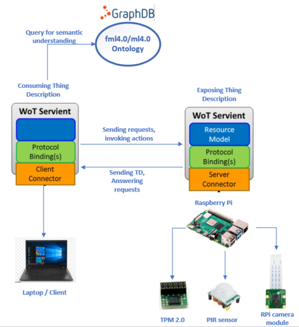

# Exposing and consuming Things for a PoC in context of Digital Twins and [Wald & Holz 4.0](https://www.kwh40.de/)

This Repo contains a PoC to use WoT with digital twins. It's more a demonstration of the WoT technology then including it in the Wald & Holz Infrastracture. 
It was developed in the context of a semester work to show capabilities of WoT and Web semanic in Digital Twins and Digital Twin infrastructure. 

## Architecture

<br>

Above you can see the Archtiecture. The whole thing consists of two Eclipse [thingweb](https://github.com/eclipse/thingweb.node-wot/) Servients connected with each other. The right Servient takes on the role of a server and the left one takes on the role of a client. 
Above all we have the Graphdb which contains the fml4.0 and ml4.0 ontology.
 It's used to ensure a semantic understanding among multiple servients. 
 The Servient is not directly integrated in the Client, instead it's an independent project to demonstrate how Thing Descriptions can be secure with a TPM. You can find it [here](https://github.com/SteinerPascal/WoT_TPM2.0)  

### Server
The Server is exposing a thing which in this case represents a Digital Twin connecting to the W&H4.0 Infrastructure. In this case the Digital Twin is a Raspberry Pi with a PIR motion Sensor and a RPi camera. For additional security there is a Trusted Platform Module 2.0 implemented. 

### Client
The Client Servient can be initiaded on a client device and is capable of consuming the W&H4.0 DT. It can then start a communication with the W&H4.0 DT. It can read Properties (location, status, last action), it can trigger some actions (take a picture) and listen to events (motion sensor got triggered).


### GraphDB
To run the docker GraphDB Free you have to apply for the free version on the offical website. Follow the official Repo instructions [here](https://github.com/Ontotext-AD/graphdb-docker).
<br>
Then import the two ontologies fml40 and ml40 from [here](https://github.com/SteinerPascal/fml4.0-rdf) and [here](https://github.com/SteinerPascal/ml4.0-rdf). On [this](https://graphdb.ontotext.com/documentation/free/quick-start-guide.html) site you can find information on how to setup a DB Repo and how to import the ontologies.
#### query
The following query is needed to get the desired device:
```
PREFIX ml40: <http://www.kwh-ontology/ml40#>
PREFIX fml40: <http://www.kwh-ontology/fml40#>
PREFIX ssn: <http://purl.oclc.org/NET/ssnx/ssn#>
PREFIX td: <http://mywotontology#>
select ?endpoint ?feature where { 
	?s a ml40:Device.
    ?sensor a ssn:SensingDevice .
    ?s ml40:hasSensor ?sensor.
    ?s fml40:Endpoint ?endpoint .
    ?feature a fml40:ObservingJob .
    ?s fml40:hasFeature ?feature   
    
} limit 100
```


### Thing Description
In order for the Server to expose the Thing it needs some Thing Description(TD). You can inspect the used TD below:

``` 
{
  "@context": [
    "https://www.w3.org/2019/wot/td/v1",
    { "@language": "en" }],
  "@type": "http://purl.oclc.org/NET/ssnx/ssn#SensingDevice",
  id: "kwh-thingID-1",
  title: "kwh-thing",
  titles: {
    "en": "kwh-thing",
    "de": "kwh-ding",
    "it": "kwh-cosa"
  },
  description: "This is an experimental kwh thing to showcase the possibilities of WoT",
  descriptions: {
    "en": "This is an experimental kwh thing to showcase the          possibilities of WoT",
    "de": "Das ist ein experimentelles Ding mit welchem die Möglichkeiten des WoT gezeigt werden können",
    "it": "Questa è una cosa sperimentale con cui si possono mostrare le possibilità di WoT"
  },
  support: "git://github.com/eclipse/thingweb.node-wot.git",
  securityDefinitions: {
    "": {
        "scheme": ""
    }
  },
  security: "",
  properties: {
    lastSnapshot: {
      description: "returns the last image taken by action takePhoto",
      forms: [{
          contentType: "image/png"
      }]
    },
    movement: {
      title: "Counting the number of movements detected",
      description: "This kwh-thing includes a pir motion sensor. This field shows the number of movements which got detected",
      unit: "",
      type: "integer",
      observable: true,
      readOnly: true
    }
  },
  actions: {
    takePhoto: {
      "@type": "http://www.kwh-ontology/fml40#feature",
      title: "Takes img with the mounted camera",
      description: "On this kwh-thing there is a camera attached and if invoked will take an image",
          input: {
              type: "string"
          },
          forms: [{
              op: "invokeaction",
              contentType: "application/json",
          }],
    }
  },
  events: {
    movementDetected: {
      "@type": "http://www.kwh-ontology/fml40#ObservingJob",
      title: "Trespassing alarm",
      description: "Event when subscribed notifies if movement gets detected from the PIR sensor",
      data: {
          unit: "",
          type: "string"
      }
    }
  },
}
```
The TD is represents an invented Thing and is because of demonstration purposes fairly simple. It's based on a camera trap which could be used in a forest like environment. But it might be something more sophisticated like a Digital Twin. It contains properties such as the location of the device and how many times an animal triggered the motion sensor. As an ActionAffordance it's using a camera to trigger to do a snapshot of the environment. For   

## Development Setup

VS Code [RemoteDevelopment](https://marketplace.visualstudio.com/items?itemName=ms-vscode-remote.vscode-remote-extensionpack)
<br>
follwing [this blogpost](https://pythononpow.medium.com/remote-development-on-a-raspberry-pi-with-ssh-and-vscode-a23388e24bc7)

- allow camera module;

- allow gpio read pins

- enable ssh

- change sudo $PATH ```VIM ~./bash``` and add :/home/pi/.nvm/versions/node/v14.15.0/bin
